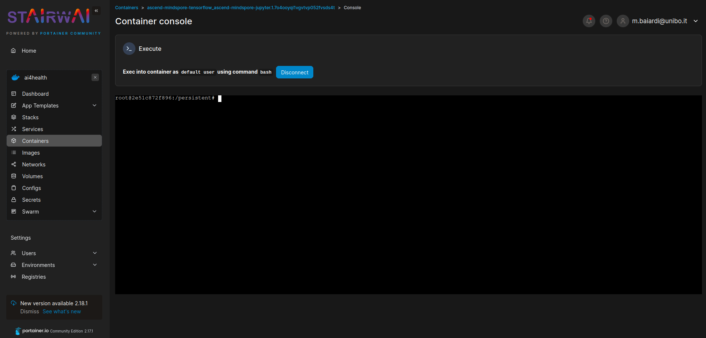

How to access deployed container
================================
There are three ways with which you can access the deployed container:

1. Access the container console through the Portainer dashboard (in the `Console` option of the container)

2. Access the container through SSH connections, this requires that the container is configured to accept them.
3. Configuring a web service inside of the container, for example, a Jupyter notebook. If you do this, you can access the service through the address ``http://<hostname>:<port>``, where the hostname is the name of the node machine on which the container is running, and the port is the one you opened to connect to your web service inside of the container.